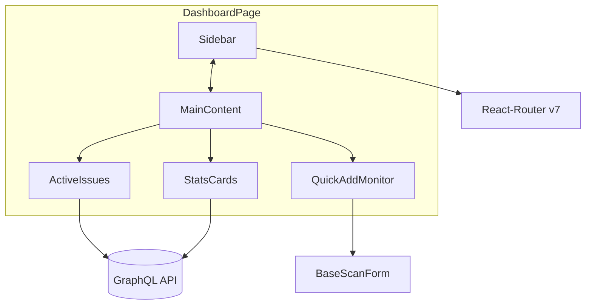

# Dashboard UI Redesign PRD

## 1. Introduction / Overview
The current Sonar dashboard presents monitoring data but lacks a modern, cohesive visual style. This initiative refactors **only the user interface** of the authenticated dashboard route (`/dashboard`) to match the v12 mock-up provided (see screenshot & Figma) using **Tailwind CSS v4**, **React 19**, and **shadcn/ui**. All existing data-fetching, routing (React Router v7), GraphQL queries/mutations, and component APIs **remain unchanged**.

Goal: deliver a polished, glass-morphism style dashboard that improves readability, aligns with brand colours, and offers a left sidebar for authenticated users, without touching business logic.

---

## 2. Goals (SMART)
1. Re-skin dashboard to be visually indistinguishable (< 5 px variance) from the reference on desktop ≥1280 px and mobile ≤640 px.
2. Achieve full WCAG AA colour-contrast on text over gradients.
3. Retain 100 % of existing Cypress/Playwright and unit tests—no regressions.
4. Load time (First Contentful Paint) must not exceed current baseline ±5 %.

---

## 3. User Stories
1. **As an authenticated user**, I see my monitoring overview in a modern UI that matches marketing material, so I feel confident in the product.
2. **As an authenticated user**, I can quickly add a monitor through a clearly styled form without scrolling.
3. **As an authenticated user**, I can navigate to other dashboard sections via a persistent sidebar on desktop and a collapsible sidebar on mobile.
4. **As a site admin**, I want zero backend changes so deployment risk stays minimal.

---

## 4. Functional Requirements
1. The dashboard must display a **left sidebar** on `/dashboard` for logged-in users with items:
   1.1 Dashboard (active highlight)
   1.2 Monitors
   1.3 Analytics
   1.4 Incidents
   1.5 Settings
   1.6 Support
2. The **sidebar hides** automatically below `md` breakpoint and can be toggled via hamburger.
3. The **header** remains for unauthenticated users only; authenticated dashboard view removes footer and header, replaced by sidebar.
4. Top-bar elements:
   4.1 Greeting text with gradient purple-blue effect.
   4.2 Notification button with badge counter.
   4.3 "Add Monitor" gradient button → opens existing create monitor flow.
5. **Statistics cards** (Total, Healthy, Issues) follow mock-up shadow, icon pill, rounded corners.
6. **Quick Add Monitor** uses `BaseScanForm`, styled per design (white inputs, subtle shadows).
7. **Active Issues table** takes full height of its card; badge with total issues count.
8. **Colour palette** strictly copied from reference (#1F5CFF, #924FFF, #0A2540 etc.).
9. All content stays responsive—stacking order follows current implementation but keeps design proportions.
10. Global CSS variables or tailwind config updated to include gradients and brand colours.
11. Implement **dummy `/pricing` page** and route "Upgrade Now" or "Get Pro" buttons there.
12. Do **not** modify GraphQL hooks, mutations, or introduce new network calls.

---

## 5. Visual Feature – Mermaid Diagram

---

## 6. Non-Goals (Out of Scope)
* Rewriting business logic, GraphQL schema, or backend.
* Altering authentication flow.
* Dark mode implementation (future work).
* Performance optimisations beyond visual tweaks.

---

## 7. Design Considerations
* Use shadcn `Card`, `Button`, `Badge`, `Sidebar` primitives.
* Tailwind v4 config will include custom `boxShadow` and gradient utilities.
* Ensure components degrade gracefully when shadcn classnames clash—prefer Tailwind utilities for overrides.
* Retain existing `data-testid` attributes for tests.

---

## 8. Technical Considerations
* Introduce a new `Sidebar.tsx` under `frontend/src/components/ui/sidebar` using shadcn patterns.
* The authenticated layout will wrap `DashboardPage` in a `SidebarProvider` (Context) for open/close state.
* Tree-shake unused Lucide icons to keep bundle size small.
* Lint & Prettier rules updated to Tailwind v4 class sorting.

---

## 9. Success Metrics
* Visual diff tests (Percy) show ≤ 2 % mismatch against reference.
* Lighthouse performance score ≥ current baseline.
* No failed Jest / Playwright tests in CI.
* Manual QA validates sidebar navigation on Chrome, Safari, Firefox mobile.

---

## 10. Open Questions
* Should the sidebar support nested items (e.g., Incidents → History)?
* Are there brand guidelines for typography (font family) to embed?
* Confirm if we need animation for "Add Monitor" button (hover pulse). 