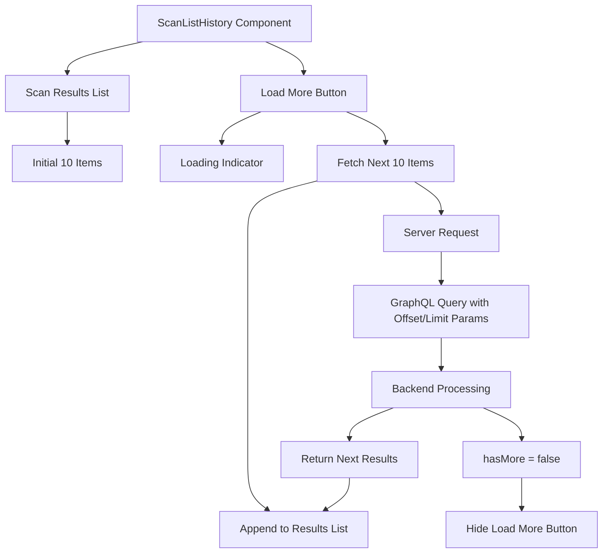

# Scan List Pagination Development Plan

## Overview
This PRD outlines the implementation of pagination for the ScanListHistory component using an offset pagination approach with a "Load More" button. The implementation will use server-side pagination to improve performance with large datasets, requiring changes to both frontend and backend.

## Goals
- Improve the performance and user experience of the scan history list by implementing pagination
- Limit the number of scans displayed at once to 10 per page
- Implement server-side pagination to reduce data transfer and improve loading times
- Match the existing design aesthetic of the application
- Preserve pagination state when applying filters and switching tabs

## User Stories
- As a user, I want to load more scan history results by clicking a "Load More" button rather than navigating through pages
- As a user, I want to see a visual indication when all results have been loaded
- As a user, I want to see a loading state when more results are being fetched
- As a user, I want the system to remember my loaded results when I filter or sort my results

## Functional Requirements

### 1. Backend Changes
1.1. Modify the GraphQL API to support pagination parameters:
   - Add `offset` and `limit` parameters to the scan query resolvers
   - Implement pagination logic in the database queries
   - Return total count of records along with the paginated results
   - Include a `hasMore` boolean flag to indicate if more results are available

1.2. Update the GraphQL schema:
   - Create a paginated response type that includes scans array and metadata
   - Include total count, offset, and hasMore in the response

1.3. Ensure pagination works with existing filtering:
   - Pagination must respect status filters
   - Pagination must respect search queries
   - Return correct total counts based on applied filters

### 2. Frontend Changes
2.1. Modify GraphQL queries to support pagination:
   - Update queries to accept pagination parameters
   - Handle the paginated response structure

2.2. Implement "Load More" UI:
   - Add a "Load More" button at the bottom of the scan list
   - Style the button to match the existing design
   - Hide the button when no more results are available

2.3. Manage pagination state:
   - Implement state management for the offset and loaded items
   - Update the state when user loads more results
   - Preserve state when applying filters or switching tabs

2.4. Update the UI to handle loading states:
   - Show loading indicators during "Load More" operations
   - Handle empty states and error conditions

## Visual Feature

## Non-Goals (Out of Scope)
- User-selectable page sizes (fixed at 10 items per load)
- Traditional page-number based pagination UI
- "Jump to page" functionality
- Infinite scroll implementation (requires explicit button click)

## Design Considerations
- The "Load More" button should use the existing dark theme styling
- Button should have hover and active states consistent with other UI elements
- A loading spinner should appear when fetching more results
- For improved mobile experience, the "Load More" button should be responsive

## Technical Considerations
- The GraphQL resolver needs to be optimized to avoid performance issues with large datasets
- Offset-based pagination will be used for simplicity and compatibility with current database queries
- The backend should validate pagination parameters to prevent abuse
- Update tests to account for pagination in both frontend and backend

## Success Metrics
- Improved frontend performance metrics (load time, memory usage)
- Reduced backend query time for scan history data
- Maintained or improved user satisfaction with the scan history feature

## Open Questions
- Should we implement caching of paginated results to improve performance further?
- How should we handle the case where data changes while a user is paginating through results? 